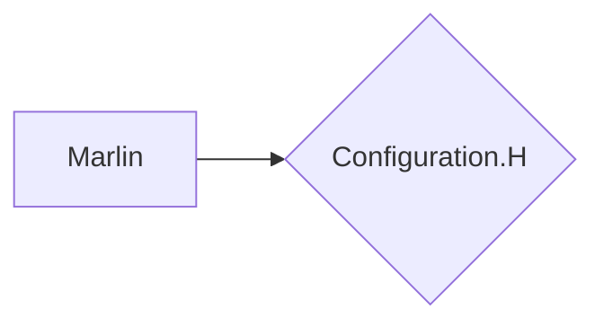

# Sobre o Projeto:

Criação de uma automação para transformação de garrafas pet para filamento 3D

# Sobre o Projeto:

- Arduino
- Ramps 1.4 
- LCD
- Driver
- Nema 17

### FLUXOGRAMA/DIAGRAMA

### FONTE:
<ul>
  
  <li>
    
<b><code>#4 Heat and motion control board - Details of free filament production from recycled bottle (PET).</code></b>

    
<i>URL: https://www.youtube.com/watch?v=gT5Xld8j5Vw</i>

  </li> 

</ul>
